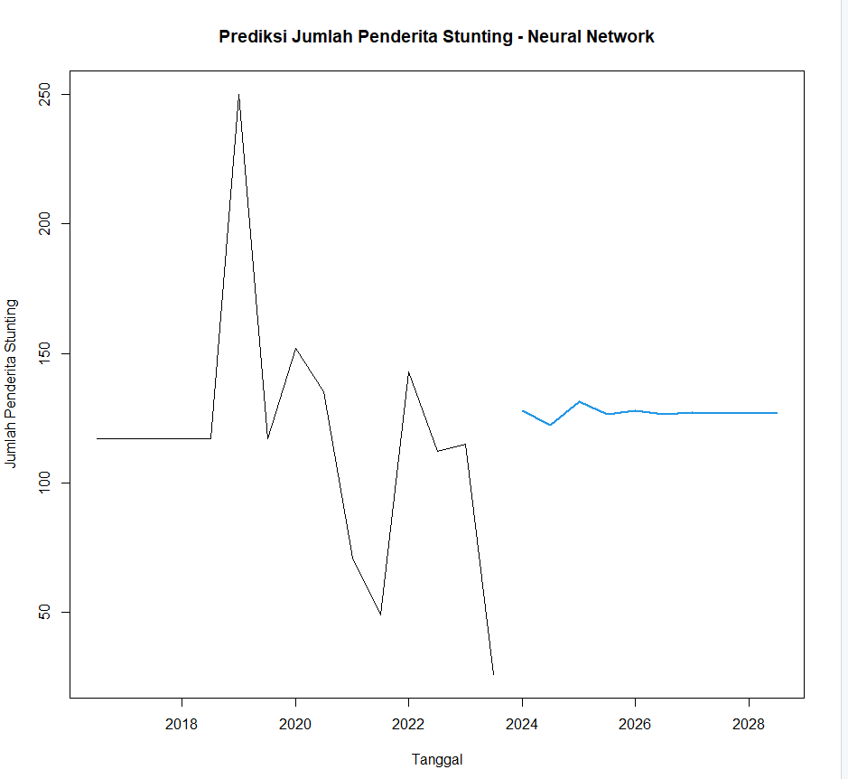
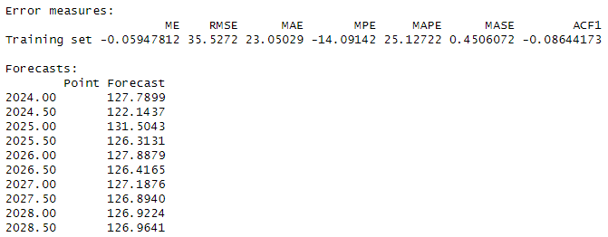
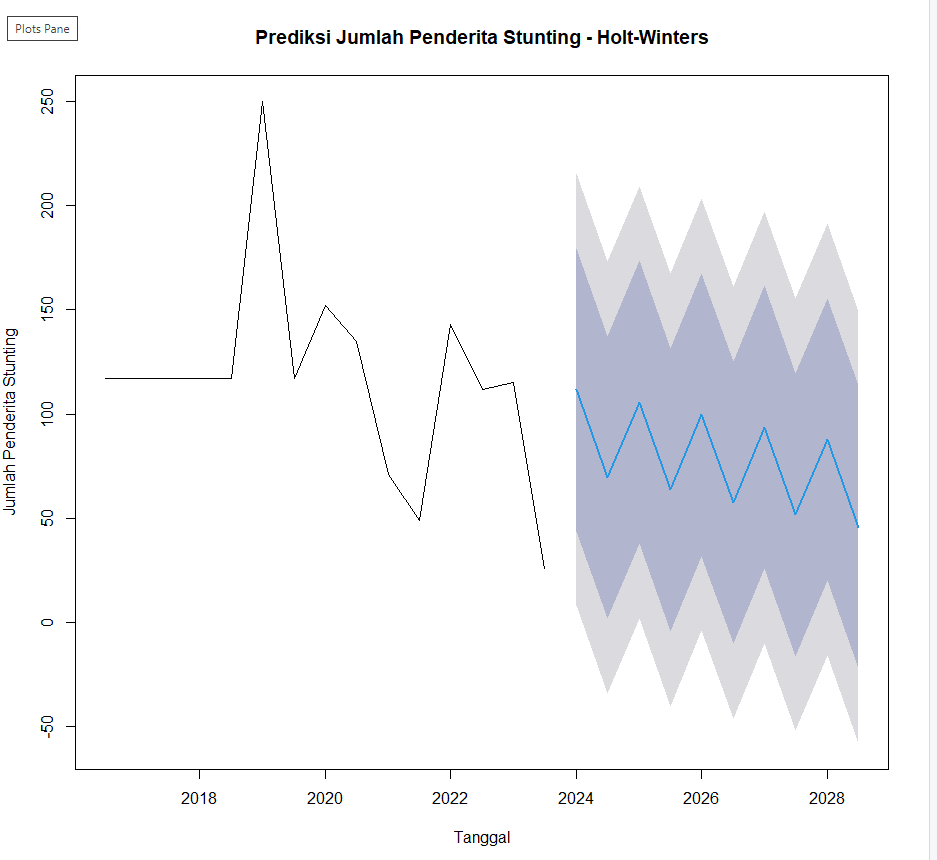
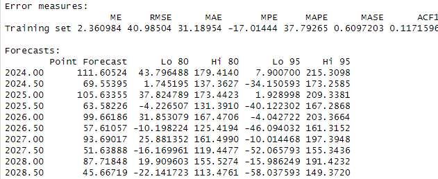
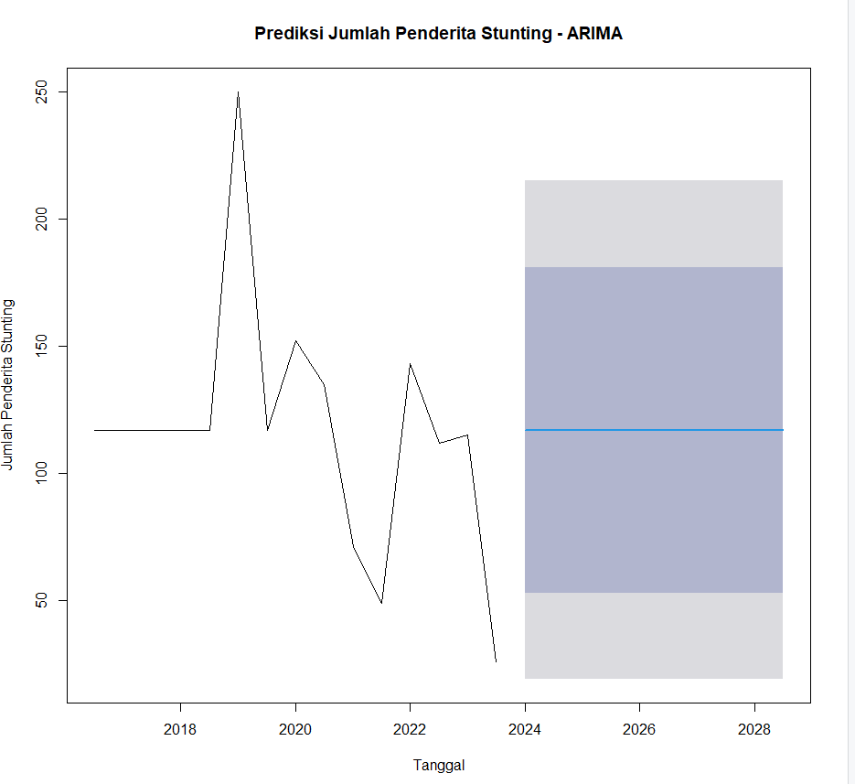
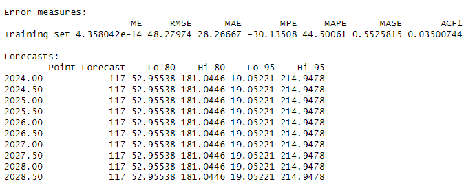
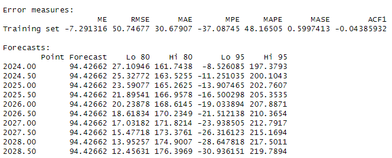

# Prediksi-Penderita-Stunting-Menggunakan-Time-Series-Analysis
Project KKN

Merupakan project akhir KKN yaitu Prediksi Penderita Stunding di Desa Baregbeg

#### hasil
##### Menggunakan Neural Network
Hasil Prediksi:

/n Akurasi:

#### hasil
##### Menggunakan Holt Winters
Hasil Prediksi:

/n Akurasi:

#### hasil
##### Menggunakan ARIMA
Hasil Prediksi:

/n Akurasi:

#### hasil
##### Menggunakan State Space
Hasil Prdiksi:

/n Akurasi:

